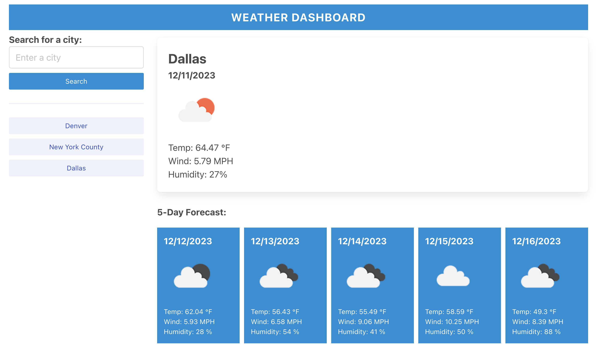
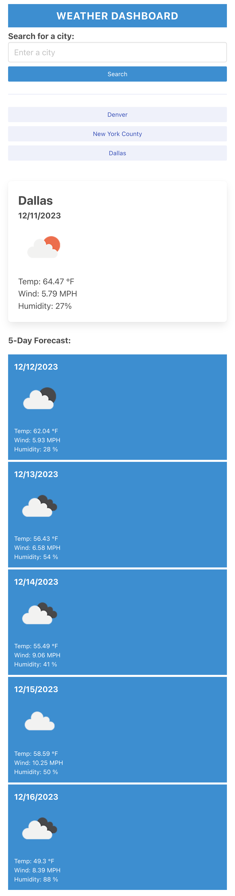

# Weather Forecast Dashboard
**[Weather Forecast Dashboard](https://salidamaharjan.github.io/weather-dashboard-challenge-06/)**

**[GitHub Repo link](https://github.com/salidamaharjan/weather-dashboard-challenge-06)**

## Description
* This project is completed to use the knowledge about server-side API which includes fetching the URL and using the data.
* This project is build to display the weather for the current day and up to next 5 days.
* The weather data is retrieved from the open weather API.
* The lat and lon in the weather API is retrieved from Geocoder API.
* The project uses external CSS library, "BULMA".

## Installation
No specific installation needed. Simply click on the Weather Forecast Dashboard link provided.

## Usage
When clicked on the deployed page, it looks like follow:

* You need to enter a city and click search this will display current day weather and up to 5 days weather like follow:

* The searched city is saved as a button below the search button.

* You can click on the saved city button and check the weather condition.

* When in the small screen the UI looks like follow:

## Credits
* [MDN Docs](https://developer.mozilla.org/en-US/) - document for `find()`and `some()` methods, Web API document
* BootCamp Instructors.
* [BULMA CSS Library](https://bulma.io/documentation/overview/start/)
* [Free Code Camp (How to write README)](https://www.freecodecamp.org/news/how-to-write-a-good-readme-file/)

## License
NA